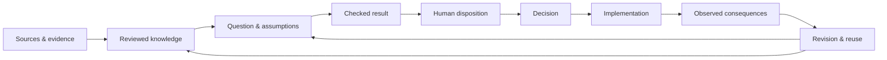

# Writ

Writ is an open, reviewable protocol for **decision provenance**.

Consequential decisions are often easier to see than the evidence, assumptions, uncertainty, review,
and revisions that produced them. Writ is building a durable way to preserve that chain so a later
human or machine can inspect what was known, what was assumed, what followed, and what needs to be
reconsidered when the underlying basis changes.

## Current focus

Writ currently connects two separate surfaces:

- **Source-grounded knowledge:** source → passage → typed record → human review → provenance.
- **Bounded decision work:** question + assumptions → checked result → applicability → human
  disposition → revision and reuse.

They can connect, but one does not silently become the other. Evidence remains distinct from
interpretation, results remain bound to the basis that justifies them, and revision preserves
history instead of overwriting it.

The immediate engineering goal is to make these pieces portable, checkable, reusable, and
correctable across more than one bounded case without hard-coding a single problem or domain.

## Roadmap

See [`docs/current/roadmap.md`](./docs/current/roadmap.md) for the current Now / Next / Later roadmap,
architecture gates, and longer-term direction.

Copyright 2026 Sara Kim
