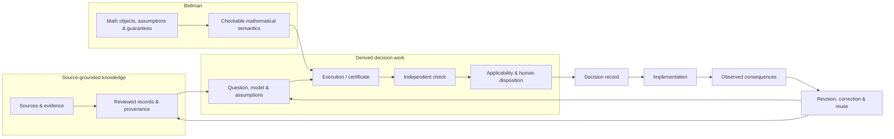

# Writ: current roadmap

**Status:** current directional roadmap
**Observation cutoff:** 10 September 2026
**Accepted baseline:** merged PR #53 (`28e0cd4f2208cc0ba5ca2e34ad474a2784960709`)

This roadmap describes where Writ is going. It is not permission to bypass accepted ADRs, source
integrity, review, or mathematical assumptions. Historical roadmaps and migrations remain evidence
of how the project got here; they do not constrain Writ to their retired product boundaries.

## At a glance

Writ is building infrastructure for a later person or machine to reconstruct a consequential
decision: its sources, assumptions, calculations, disagreements, authority, implementation,
observations, and revisions.

The project has earned bounded source-grounded records, exact decision cases, independent checking,
revision and replay, and one small post-decision provenance loop. It has not earned empirical truth,
general strategic modelling, automated recommendations, or authority to act.

Current work is testing whether one awkward empirical result can travel to a separate research
consumer, be reproduced and challenged, and return as a linked successor assessment without
overwriting the original. The long-term destination remains strategic-security reasoning under
adversarial uncertainty. Interoperable research handoff is an enabling layer, not a substitute for
that destination.

The sections below use three meanings deliberately:

- **Earned** means implemented and accepted within a stated boundary.
- **Current** means authorized work whose result is not yet known.
- **Future** means a research direction that still needs a concrete question, mathematics, evidence,
  and an architecture gate.

## One completed enabling demonstration

The [completion report](../../examples/assessments/revisable-pilot/COMPLETION_REPORT.md)
retains real Writ–Vela receiving, two source updates, six fresh AI contexts and actual
browser-exported requests with independent receiving. Both structured and competent
prose conditions scored 71/72; no continuation advantage or human benefit is established.
The user narrowed the HTML to a disposable demonstration, not a maintained website.
The initial failed export, code repair, copied-text observation and later actual file
receiving remain distinct. General UI usability is untested and outside that revised
scope. Required local, real native integration and hosted checks passed. No further UI
engineering or experiment is active; human comparison remains optional future research.
This result earns bounded provenance and handoff capability, not strategic-security
validity or a new mathematical guarantee.

## North Star

> **Make consequential decision-making mathematically inspectable, cumulative, and correctable.**

Writ should eventually let a recipient reconstruct not only *what* was concluded, but the chain that
made the conclusion usable and the conditions under which it must be reconsidered.

The rendered image is generated from [`writ-north-star.mmd`](./writ-north-star.mmd). The Mermaid
source is the inspectable diagram definition.

The user-adopted [strategic-security moonshot](strategic-security-moonshot.md) supplies the
long-term destination: explicit actors, capabilities, beliefs, incentives, commitments, evidence,
possible worlds, and failure conditions. Its plain-language cycle is to map the situation, model it,
explore possible outcomes, independently challenge the assumptions, take a human-authorized action,
observe, and remap. Every transition needs a separate warrant. The current non-security pilots are
bounded enabling tests, not evidence of strategic advantage.

## Earned now

1. **The first bounded derived-decision architecture has passed its human gate.** ADR 0026 and ADR
   0028 are Accepted after PR #43 and PR #47 demonstrated exact execution/checking, separately
   authored analysis import, explicit revision/reassessment, old-result preservation, successor
   recomputation, and checker-only replay. Treat this as a bounded capability, not a general
   decision workspace.
2. **Retain the one Bellman transfer that passed end-to-end review.** Merged PR #51 pins Decision
   Lab's merged certificate-transport adapter and reuses the accepted PR #47 lifecycle rather than
   creating a new revision system. It earns only a revision-bound checked mathematical transition:
   preserved old result -> substantive model/policy revision -> stale applicability -> explicit
   reassessment -> transported successor certificate -> checker-only recipient replay.
3. **Retain the accepted bounded post-check provenance loop.** ADR 0029 and PR #53 add a
   `decision_episode` that composes the accepted transition with a supplied authority basis,
   explicit human/institutional decision, implementation, observation and reconsideration. Exact
   cross-artifact binding and fresh replay remain mandatory, without inferring authority,
   causality, correctness or a model update.
4. **Keep the knowledge layer strong without making it the whole roadmap.** Continue NIST source,
   review, provenance, and correction work where it reveals reusable knowledge-layer requirements.
   Do not let “NIST is the proving ground” become “Writ is only a corpus system.”
5. **Stop the mathematics expansion after the accepted transport slice.** The transition object is
   retained narrowly because its history, staleness, reassessment, binding, and replay safeguards
   justify its integration complexity. That judgment is not a queue to implement Bellman PR #7 or
   later modules.

The [PR #53 repair review](../experiments/decision-episode-repair-review.md) recommends retaining
that bounded episode after identity, calendar and fresh-warrant repairs. Combined local acceptance
passed, and the final review records the accepted head and hosted checks. The repair recommendation
preceded and did not itself supply architecture acceptance. The subsequent human gate accepted ADR
0029 after final review; it did not reopen the completed assessment experiment.

The user then authorized two ordered additions on PR #53: an actual external producer and linked
episodes. The [external/linked review](../experiments/external-linked-episode-review.md) records a
pinned SimPy run and one service-assumption revision whose parent events actually resolve. The
external trace is model-generated; native mathematical history is preserved and checked separately.
This is a bounded engineering addition, not another empirical study or automatic model transfer.
Both additions passed combined local acceptance at `2a00603`; the final review then confirmed the
final-head hosted checks and accepted them only within ADR 0029's closed profile.

The user subsequently authorized one bounded simulation-to-decision connection on the same PR.
The [current operation](simulation-to-decision.md) compares three actual deterministic FIFO runs
under an explicit supplied integer loss, revises the unvalidated base-service assumption, reruns
every option and independently recomputes the conditional ranking. A separate revision record binds
both comparisons to immutable episodes; the successor human act defers adoption despite the new
conditional preference. This accepted profile adds neither empirical validity nor new Bellman
mathematics and does not widen the native certificate-transport profile.

**Exit gate from Now: passed.** The build proves one exact decision-to-reconsideration story and one
exact simulation-to-decision revision, compares the envelopes with loose files, passes
producer-disabled recipient replay, and received explicit human acceptance of ADR 0029. The
accepted boundary stops here; green checks alone do not authorize another capability.

## Current empirical handoff build

The next build is authorized and active, but not yet an earned capability. It uses Bellman's retained
AFY 2024 case together with its existing R/Python analysis, `stratEst`, SciPy, exact checks, and
independent receiver. A pinned RO-Crate profile and standard `ro-crate-py` consumer provide the
outer research-handoff envelope. Writ should add only the narrow connection needed to preserve and
recheck its own semantics.

The case was selected because it exposes a real decision problem about model reliance without
rewarding a positive result. Its retained evidence says:

- the main strategic-model comparison is inconclusive;
- a simple Markov/report predictor performed better in the recorded comparison;
- conclusions depend on supplied utility and prior assumptions; and
- beliefs were reported after the participant's action, limiting intervention or mechanism claims.

The build asks whether reliance on the strategic predictor is warranted. It does not ask Writ to
recommend a demonstrated policy. A conditional or unresolved successor assessment is a valid
outcome.

The planned round trip is:

1. export the exact permitted research files and references in a pinned RO-Crate envelope;
2. open the crate in a separate process with a standard non-Writ consumer;
3. run the original reproduction and focused independent checks;
4. give a fresh machine recipient the evidence and task without an expected answer;
5. challenge one supplied assumption or intended use, including a stale or mistaken use that must
   be refused or reconsidered; and
6. return a linked assessment that preserves both the original and successor and states what
   changed, what remains supported, and whether reliance is warranted.

Data access and redistribution terms govern what can be embedded. Archive metadata must never be
substituted for data bytes that were not actually obtained. Existing and frozen AFY evidence remains
unchanged.

The result must report crate conformance, byte identity, numerical reproduction, empirical support,
applicability, and supplied human or machine disposition separately. A machine recipient is
sufficient for this internal continuation test; it does not establish human usefulness.

**Exit gate from the current build:** a real standard RO-Crate consumer opens the exported object;
the appropriate original and independent checks pass or their failures are retained; one material
assumption or intended use is challenged; one invalid or stale reuse is refused; and Writ receives a
linked successor without changing the original. Retain the adapter only if this demonstrates a
concrete interoperability benefit over the existing portable directory. Otherwise retain the
executed gap and the simpler directory.

## Next after that gate

1. **Use the accepted decision episode only within its earned provenance boundary.** Preserve the
   exact checked-history binding and supplied post-check declarations without turning the episode
   into workflow state, empirical validation or authority. Keep the separate-file baseline for
   cases that do not need the accepted binding and replay safeguards.
2. **Use the retained transition semantic only where an actual Writ workflow needs it.** Preserve the
   exact source-certificate bytes and prior claim context, exact revised basis, explicit
   complete model-to-request mapping premise, successor certificate, fresh source-certificate status,
   target-certificate status, transport-provenance status, and replay identity without pretending
   that archival preservation establishes validity or that the mapping premise is empirically true.
3. **Make cumulative reuse operational only where a concrete workflow needs the next operation.** A
   later result may receive a transported or tightened certificate and coexist with alternatives or
   incompatible results, but certificate accumulation/selection should enter only after a specific
   downstream use demonstrates the need.
4. **Exercise broader change stories before broadening the core.** Distinguish archived bytes and
   prior claim context from fresh source-certificate status, current inapplicability, unsupported
   transport, valid target certificate with invalid transport provenance, and justified successor
   reuse.
5. **Test the language/runtime threshold rather than guessing.** When two or three genuinely
   different Bellman certificate types depend on Writ checking, compare a small Rust exact checker
   with the current Python reference. If handwritten Python search becomes the mathematical
   bottleneck, compare Julia/JuMP or another established optimizer on one existing problem. Do not
   migrate merely for aesthetics.

**Exit gate from Next:** Writ can preserve and correctly reassess several distinct checked decision
results across revisions without hard-coding one case or one mathematical family into the core.

## Reuse before new infrastructure

Before implementing a new roadmap capability, record a short reuse decision:

1. the exact claim or operation needed;
2. candidate mathematics and maintained software;
3. exact version, source identity, licence, and installation burden;
4. one bounded executed example;
5. input/output meaning, translation losses, and maintenance cost; and
6. the concrete gap that remains.

Prefer an existing API or command-line tool, then a narrow adapter, then a justified upstream patch
or fork, and only then new general-purpose code. Do not repeat a broad landscape review for every
small edit, and do not install every candidate in advance.

Current likely boundary tools include pyAgrum for a justified influence diagram, EMA Workbench for
several explicit uncertain scenarios, `voi` for richer decision-value-of-information calculations,
and later strategic or formal tools for a specific supported question. Their presence on the
research map is not compatibility evidence. Exact licence and execution checks remain mandatory.
OpenMarkov's bundled sensitivity plug-in is not open source; PyCID's inspected alpha packaging and
old dependency pins make compatibility unproved. Information gain is not automatically decision
value, and success in sampled scenarios is not automatically a probability of real-world success.

## Future strategic-security programme

1. **Map the situation.** Preserve explicit actors, capabilities, objectives, beliefs, incentives,
   commitments, dependencies, evidence, uncertainties, and disagreements. A map can be incomplete;
   a confidence score is not a substitute for its reasons.
2. **Model the decision.** State the exact question, actions, information available at each point,
   mechanisms, preferences, causal assumptions, possible worlds, and failure conditions. Do not
   turn domain vocabulary into a universal Writ ontology.
3. **Explore possible outcomes.** Use established simulation, game, causal, or robust-decision tools
   only where their semantics fit. Scenario coverage, probabilities, and real-world adequacy remain
   supplied or separately earned.
4. **Independently challenge the assumptions.** Compare alternative explanations, adversarial
   reactions, deception, strategic disclosure, missing evidence, and ways the model could fail.
   Finding no counterexample is not a completeness proof.
5. **Support a human-authorized act.** Preserve the checked result, applicability judgment, human or
   institutional disposition, and authority separately. A solver may propose an option; it cannot
   grant permission.
6. **Observe and remap.** Keep implementation and observations distinct from causal interpretation.
   Preserve old conditional results, record changed dependencies, and create linked successors
   rather than rewriting history.
7. **Make the knowledge cumulative.** Retrieve earlier work by its question, assumptions,
   dependencies, guarantees, and failure boundaries—not by headline answer alone.

Consequential-domain proving grounds may include war, security strategy, intelligence, biosecurity,
or AI governance. They should test the substrate without making a substantive domain the core
ontology or representing a bounded example as comprehensive strategic prediction.

Richer causal, robust, information-acquisition, sequential, strategic, safety, or formal checking
enters only when the relevant Bellman contract or established donor semantics are precise enough to
compose safely. Each capability must state what it preserves, what it assumes, what it composes
with, and what invalidates reuse.

## Repository hygiene

**Retired in this governance reset:** the provisional Track B multi-reviewer agent skill and its
current-role outcome log. Their useful lessons have already been promoted into tests, diagnostics,
and invariants; keeping reviewer personas active would preserve an experiment after its purpose was
served.

**Keep:** `docs/migrations/` as historical evidence; `apps/ingest` because current
source-registry/tooling still consumes it; `TASKS.yaml` as the execution ledger.

**Retired in the root-hygiene cleanup:** the tracked `archive/` root. Exact EU-US, G7, and G20
snapshots remain recoverable through lightweight Git tags indexed in `docs/history/snapshots.md`.
The first synthetic decision fixture lives under `examples/decision-cases/`, which makes its
illustrative role explicit without changing its case, revision, execution, or mathematical
identities.

**Retired in the database cleanup:** the legacy Postgres/Neon persistence package, migrations,
database publication paths, Docker/environment wiring, database CI, and database-specific
dependencies. Generic source discovery and acquisition remain, with acquired bytes written only to
an explicit caller-owned output path. ADR 0027 records this implemented architecture as Proposed
pending explicit human disposition.

**Future cleanup:** split or compact completed historical entries in `TASKS.yaml` if the execution
ledger itself begins obscuring active work. Do not delete accepted ADRs merely because their active
architecture has been superseded; later decisions should preserve that history.
