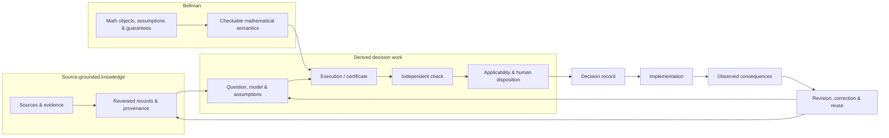

# Writ: current roadmap

**Status:** current directional roadmap  
**Observation cutoff:** 7 September 2026  
**Baseline:** `main` after PR #43 (`99c7e4f31bbd3a405e19176b13cd776f4b16a0db`)

This roadmap describes where Writ is going. It is not permission to bypass accepted ADRs, source
integrity, review, or mathematical assumptions. Historical roadmaps and migrations remain evidence
of how the project got here; they do not constrain Writ to their retired product boundaries.

## North Star

> **Make consequential decision-making mathematically inspectable, cumulative, and correctable.**

Writ should eventually let a recipient reconstruct not only *what* was concluded, but the chain that
made the conclusion usable and the conditions under which it must be reconsidered.

The rendered image is generated from [`writ-north-star.mmd`](./writ-north-star.mmd). The Mermaid
source is the inspectable diagram definition.

## Now

1. **Stabilize the first derived decision boundary.** Treat the merged PR #43 implementation as a
   bounded capability, not a general decision workspace. Resolve ADR 0026's human architecture
   status explicitly. Preserve fresh checking, exact subject binding, applicability, and human
   disposition as separate meanings.
2. **Prove the layer is reusable rather than fixture-specific.** Author a second synthetic case from
   the published contract without changing the package merely to accommodate it. Use the existing
   finite-linear-uncertainty profile first; the test is whether another author/recipient can use the
   boundary, not whether Writ can add more mathematics quickly.
3. **Keep the knowledge layer strong without making it the whole roadmap.** Continue NIST source,
   review, provenance, and correction work where it reveals reusable knowledge-layer requirements.
   Do not let “NIST is the proving ground” become “Writ is only a corpus system.”
4. **Align repository governance with the current direction.** Current docs and agent instructions
   should describe both source-grounded knowledge and derived mathematical work. Retire one-off agent
   experiments once their durable lessons live in tests and invariants.

**Exit gate from Now:** a clean second-case handoff, explicit ADR 0026 disposition, and no unresolved
semantic disagreement between the roadmap, product definition, schemas, and executable behavior.

## Next

1. **Bring in the next stable Bellman semantics deliberately.** Prefer one mature capability whose
   mathematical assumptions and checker boundary are already clear—such as sequential whole-policy
   certificates, certificate transport/revalidation, or accumulated/tightened certificates—rather
   than creating a generic solver registry.
2. **Make cumulative reuse operational.** A result should be able to remain valid under old premises,
   become inapplicable under a changed dependency, receive a new transported/tightened certificate,
   and coexist with alternative or incompatible results without forcing consensus.
3. **Exercise a complete change story.** Start from evidence/model assumptions, obtain a checked
   result, change one substantive premise, identify what becomes stale, and construct the justified
   successor result. The point is inspectable correction, not merely rerunning a script.
4. **Test the language/runtime threshold rather than guessing.** When two or three genuinely
   different Bellman certificate types depend on Writ checking, compare a small Rust exact checker
   with the current Python reference. If handwritten Python search becomes the mathematical
   bottleneck, compare Julia/JuMP or another established optimizer on one existing problem. Do not
   migrate merely for aesthetics.

**Exit gate from Next:** Writ can preserve and correctly reassess several distinct checked decision
results across revisions without hard-coding one case or one mathematical family into the core.

## Later

1. **Cumulative decision knowledge.** Retrieve prior results by the questions, assumptions,
   dependencies, guarantees, and failure boundaries that make them reusable—not by headline answer
   alone.
2. **Richer mathematical components when earned.** Add causal intervention semantics, robust/model
   uncertainty, information acquisition, sequential planning, constraints, tail risk, or strategic
   response only when their Bellman contracts are stable enough to compose safely.
3. **Consequential-domain proving grounds.** Stress-test the substrate in war, security strategy,
   intelligence, biosecurity, AI governance, or other high-stakes domains without turning the
   substantive domain into the core ontology.
4. **Human-machine decision systems.** Preserve policy, evidence, uncertainty, causal/strategic
   assumptions, institutional authority, implementation, and consequences so humans and machines
   can inspect the same decision object without pretending political judgment is simply executable
   code.

The target is reached incrementally: each new capability must state exactly what it preserves, what
it assumes, what it can be composed with, and what invalidates its reuse.

## Repository hygiene

**Retired in this governance reset:** the provisional Track B multi-reviewer agent skill and its
current-role outcome log. Their useful lessons have already been promoted into tests, diagnostics,
and invariants; keeping reviewer personas active would preserve an experiment after its purpose was
served.

**Keep for now:** `archive/` and `docs/migrations/` as historical evidence; `apps/ingest` because
current source-registry/tooling still consumes it; `TASKS.yaml` as the execution ledger.

**Audit separately before deletion:** `apps/api` and the retained Postgres/database surface. Current
code describes them as retained storage primitives pending a decision. They are a plausible
retirement candidate, but removing a tested workspace package, database migrations, Docker
configuration, and dependencies deserves a bounded consumer/retirement check rather than a
roadmap-document cleanup.

**Future cleanup:** split or compact completed historical entries in `TASKS.yaml` if the execution
ledger itself begins obscuring active work. Do not delete accepted ADRs merely because their active
architecture has been superseded; later decisions should preserve that history.
