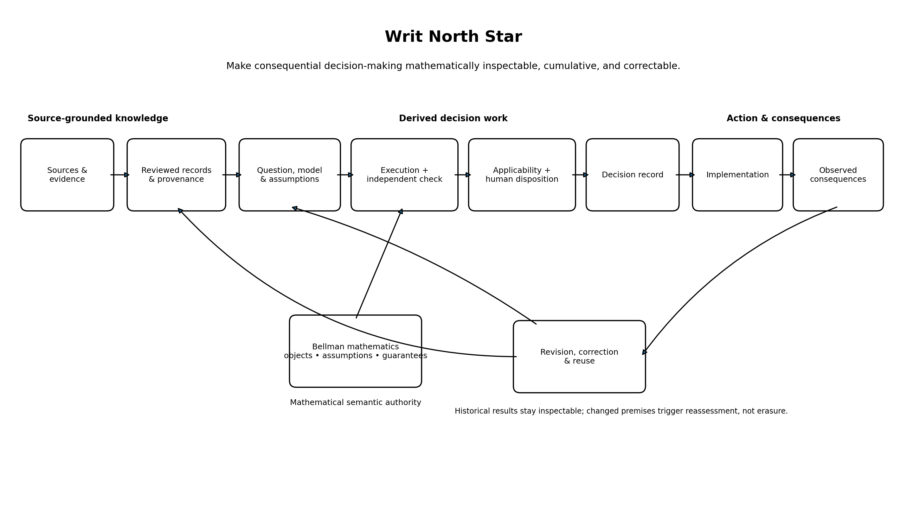
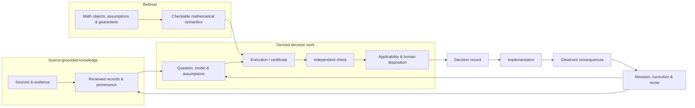

# Writ: current roadmap

**Status:** current directional roadmap  
**Observation cutoff:** 7 September 2026  
**Baseline:** `main` after PR #52 (`d4f2769f1f7e935809225677505779a62770dcde`)

This roadmap describes where Writ is going. It is not permission to bypass accepted ADRs, source
integrity, review, or mathematical assumptions. Historical roadmaps and migrations remain evidence
of how the project got here; they do not constrain Writ to their retired product boundaries.

## North Star

> **Make consequential decision-making mathematically inspectable, cumulative, and correctable.**

Writ should eventually let a recipient reconstruct not only *what* was concluded, but the chain that
made the conclusion usable and the conditions under which it must be reconsidered.

The rendered image is generated from [`writ-north-star.mmd`](./writ-north-star.mmd). The Mermaid
source is the inspectable diagram definition.

## Now

1. **The first bounded derived-decision architecture has passed its human gate.** ADR 0026 and ADR
   0028 are Accepted after PR #43 and PR #47 demonstrated exact execution/checking, separately
   authored analysis import, explicit revision/reassessment, old-result preservation, successor
   recomputation, and checker-only replay. Treat this as a bounded capability, not a general
   decision workspace.
2. **Retain the one Bellman transfer that passed end-to-end review.** PR #51 pins Decision Lab's
   merged certificate-transport adapter and reuses the accepted PR #47 lifecycle rather than
   creating a new revision system. It earns only a revision-bound checked mathematical transition:
   preserved old result -> substantive model/policy revision -> stale applicability -> explicit
   reassessment -> transported successor certificate -> checker-only recipient replay.
3. **Keep the knowledge layer strong without making it the whole roadmap.** Continue NIST source,
   review, provenance, and correction work where it reveals reusable knowledge-layer requirements.
   Do not let “NIST is the proving ground” become “Writ is only a corpus system.”
4. **Stop after the accepted transport slice.** The transition object is retained narrowly because
   its history, staleness, reassessment, binding, and replay safeguards justify its integration
   complexity. That judgment is not a queue to implement Bellman PR #7 or later modules.

**Exit gate from Now:** PR #51's complete certificate-transport change story passes fresh checking,
adversarial controls, and recipient replay without weakening ADR 0026/0028 boundaries, and remains
limited to the accepted revision-bound checked mathematical transition.

## Next

1. **Use the retained transition semantic only where an actual Writ workflow needs it.** Preserve the
   exact source-certificate bytes and prior claim context, exact revised basis, explicit
   complete model-to-request mapping premise, successor certificate, fresh source-certificate status,
   target-certificate status, transport-provenance status, and replay identity without pretending
   that archival preservation establishes validity or that the mapping premise is empirically true.
2. **Make cumulative reuse operational only where a concrete workflow needs the next operation.** A
   later result may receive a transported or tightened certificate and coexist with alternatives or
   incompatible results, but certificate accumulation/selection should enter only after a specific
   downstream use demonstrates the need.
3. **Exercise broader change stories before broadening the core.** Distinguish archived bytes and
   prior claim context from fresh source-certificate status, current inapplicability, unsupported
   transport, valid target certificate with invalid transport provenance, and justified successor
   reuse.
4. **Test the language/runtime threshold rather than guessing.** When two or three genuinely
   different Bellman certificate types depend on Writ checking, compare a small Rust exact checker
   with the current Python reference. If handwritten Python search becomes the mathematical
   bottleneck, compare Julia/JuMP or another established optimizer on one existing problem. Do not
   migrate merely for aesthetics.

**Exit gate from Next:** Writ can preserve and correctly reassess several distinct checked decision
results across revisions without hard-coding one case or one mathematical family into the core.

## Later

1. **Cumulative decision knowledge.** Retrieve prior results by the questions, assumptions,
   dependencies, guarantees, and failure boundaries that make them reusable—not by headline answer
   alone.
2. **Richer mathematical components when earned.** Add causal intervention semantics, robust/model
   uncertainty, information acquisition, sequential planning, constraints, tail risk, or strategic
   response only when their Bellman contracts are stable enough to compose safely.
3. **Consequential-domain proving grounds.** Stress-test the substrate in war, security strategy,
   intelligence, biosecurity, AI governance, or other high-stakes domains without turning the
   substantive domain into the core ontology.
4. **Human-machine decision systems.** Preserve policy, evidence, uncertainty, causal/strategic
   assumptions, institutional authority, implementation, and consequences so humans and machines
   can inspect the same decision object without pretending political judgment is simply executable
   code.

The target is reached incrementally: each new capability must state exactly what it preserves, what
it assumes, what it can be composed with, and what invalidates its reuse.

## Repository hygiene

**Retired in this governance reset:** the provisional Track B multi-reviewer agent skill and its
current-role outcome log. Their useful lessons have already been promoted into tests, diagnostics,
and invariants; keeping reviewer personas active would preserve an experiment after its purpose was
served.

**Keep:** `docs/migrations/` as historical evidence; `apps/ingest` because current
source-registry/tooling still consumes it; `TASKS.yaml` as the execution ledger.

**Retired in the root-hygiene cleanup:** the tracked `archive/` root. Exact EU-US, G7, and G20
snapshots remain recoverable through lightweight Git tags indexed in `docs/history/snapshots.md`.
The first synthetic decision fixture lives under `examples/decision-cases/`, which makes its
illustrative role explicit without changing its case, revision, execution, or mathematical
identities.

**Retired in the database cleanup:** the legacy Postgres/Neon persistence package, migrations,
database publication paths, Docker/environment wiring, database CI, and database-specific
dependencies. Generic source discovery and acquisition remain, with acquired bytes written only to
an explicit caller-owned output path. ADR 0027 records this implemented architecture as Proposed
pending explicit human disposition.

**Future cleanup:** split or compact completed historical entries in `TASKS.yaml` if the execution
ledger itself begins obscuring active work. Do not delete accepted ADRs merely because their active
architecture has been superseded; later decisions should preserve that history.
